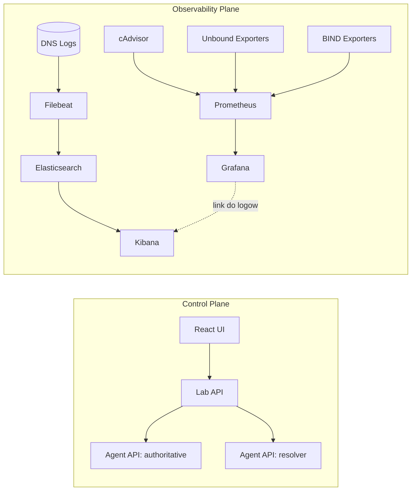

# Obserwowalnosc Labu DNSSEC (Rozdzial do pracy)

Ponizszy rozdzial opisuje architekture obserwowalnosci, przeplywy danych oraz sposob
przygotowania dowodow do czesci badawczej i wnioskow.

**Zakres**
- Metryki: Prometheus + Grafana + cAdvisor + eksportery Unbound/BIND.
- Logi: Filebeat -> Elasticsearch -> Kibana.
- Korelacja: linki Grafana -> Kibana i zapisane wyszukiwania.

**Architektura (control-plane vs observability-plane)**

**Przeplywy danych**
- Metryki kontenerow: cAdvisor -> Prometheus -> Grafana.
- Metryki DNS (resolver): unbound-exporter -> Prometheus -> Grafana.
- Metryki DNS (authoritative): bind-exporter -> Prometheus -> Grafana.
- Logi DNS: Unbound/BIND/Lab API -> Filebeat -> Elasticsearch -> Kibana.
- Korelacja: panel Grafany otwiera Kibane z takim samym zakresem czasu.

**Konfiguracja bezpieczenstwa (obserwowalnosc)**
- Uslugi obserwowalnosci sa publikowane lokalnie: `127.0.0.1:9090`, `127.0.0.1:3000`, `127.0.0.1:5601`.
- `observability_net` jest siecia wewnetrzna (izolacja od innych sieci Dockera).
- `obs_access` sluzy tylko do publikacji portow localhost.
- Hasla do Grafany i Kibany znajduja sie w `observability/observability.env`.

**Dowody do czesci badawczej**
Wykresy Grafana:
- "DNS Lab Containers" (CPU/RAM/NET per container).
- "Resolver DNS Stats" (QPS, cache hit ratio, NXDOMAIN/SERVFAIL).
- "Authoritative Stats" (queries per second, response codes).
Logi Kibana:
- Saved search: "DNSSEC Validation Failures".
- Saved search: "NXDOMAIN Flood".
Korelacja:
- Linki z paneli Grafany do odpowiedniego widoku w Kibanie.

**Scenariusz eksperymentu (przyklad)**
1. Uruchom demo agresywnego NSEC (endpoint w `lab_api`).
2. W Grafanie zarejestruj spadek liczby zapytan upstream (cache / aggressive NSEC).
3. W Kibanie potwierdz wzrost NXDOMAIN i wpisy walidacji DNSSEC.
4. Zapisz artifact (JSON/ZIP) i porownaj ON vs OFF w sekcji wnioskow.

**Wnioski (szkielet)**
1. Agresywny NSEC redukuje liczbe zapytan do authoritative przy zachowaniu poprawnej walidacji.
2. Separacja warstw control/observability upraszcza korelacje metryk i logow.
3. Izolacja sieci + lokalne publikowanie portow minimalizuje ekspozycje paneli.

**Screenshoty i zalaczniki**
Ponizsze pliki sa oczekiwane w repo (wklej rzeczywiste zrzuty ekranu):
- `docs/observability-assets/grafana-dns-lab-containers.png`
- `docs/observability-assets/grafana-resolver-dns-stats.png`
- `docs/observability-assets/grafana-authoritative-stats.png`
- `docs/observability-assets/kibana-dnssec-validation-failures.png`
- `docs/observability-assets/kibana-nxdomain-flood.png`

Uwaga: po imporcie `observability/kibana/saved_objects.ndjson` zrzuty powinny
pokazywac aktywne filtry i zakres czasu z demo.
